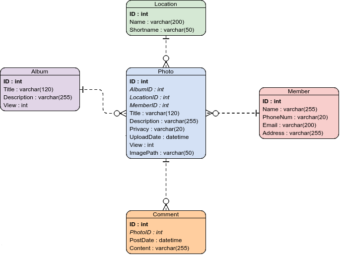
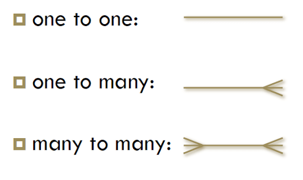

# One To Many Relationships

## SWBATs:
1. Implement one object to many objects relationship
    * one object _has many_ objects
    * one object _belongs to_ another object
2. Demonstrate the concept of an Entity Relationship Diagram
3. Demonstrate Single Source of Truth
4. Infer type of method (class or instance) through naming conventions

- Quick Review of OOP
    - we created classes
    - we created instances of classes using `initialize`
    - we wrote instance and class methods
    - we created instance and class variables
    - we used attr_macros for getters and setters
        - `attr_reader` - getter
        - `attr_writer` - setter
        - `attr_accessor` - getter/setter
    - we used `self` in class and instance methods & saw that `self` is whoever calls the method

_____
What do the following mean in plain English? How about in programming?

 

Model

<pre>A represention of a real world concept; A blueprint; A cookie cutter; An object factory; A class</pre>

 

Domain

<pre>Set of possible values within a realm; Domain name - string that defines a realm within the internet (ex. youtube.com, facebook.com, twitter.com)

youtube.com

- videos, comments, channels, users, playlists

a video has many comments.
a comment belongs to that one specific video.

a channel has lots of videos.
each video belongs to that channel.

one user has many videos
a video belongs to that one user

a user has many channels
a channel belongs one user

twitter.com
- tweets, media, ads, retweets, replies, direct messages, followers, users

one tweet has many retweets
each retweet belongs to a single tweet

user has many dms
each dm belongs to a user

user has many tweets
tweet belongs to one user
</pre>

 

Domain Modeling

<pre>
A conceptual representaion of a domain; Used to document a software system using diagrams and symbols
</pre>

Relationships

<pre>
- one to many
- many to many
</pre>

How can we think about relationships?
1. For every one (x), how many (y)?
2. For every one (y), how many (x)?

## Entity Relationship Diagrams

An entity relationship diagram is a diagraming tool that programmers use to visualize the relationships between entities. The ERD allows us to graphically represent data requirements.

Take an educated guess at the relationships described by the diagram above before moving on

<pre>
<ul>
<li>An album has many photos</li>
<li>A photo belongs to one album</li>
<li>One location can belong to many photos</li>
<li>A photo has one location</li>
<li>A photo can have many comments</li>
<li>A comment belongs to one photo</li>
<li>A member has many photos</li>
<li>A photo belongs to one member</li>
</ul>
</pre>

Below is a basic overview of the notation used  to describe cardinality in these ER diagrams. Today we will be covering one to many relationships and tomorrow, we will cover many to many relationships.

In order to draw your ER diagrams, you can draw it out on paper or also using many available online tools such as [this online whiteboard tool](https://miro.com/welcome/SpedLD4dDGw5Wb6YzbTvwNCod1vdkv9k8bEPxSIELqXtQueDh7tFhgtsAtk53Eyy).

What are some one to many relationships that you can think of?

<pre>
examples:
<ul>
<li>A state has many cities</li>
<li>A performer has many albums</li>
<li>An album has many songs</li>
<li>A video has many comments</li>
<li>A user has many tweets</li>
<li>A primary care doctor has many patients</li>
</ul>
</pre>

____

## require VS require_relative

As we've seen from the prework, we write `require 'pry'` at the top of a file whenever we want to use pry. The keyword `require` allows us to import a gem into our file so that we have access to it.

Let's say we have three files called `user.rb`, `tweet.rb`, and `main.rb`. In `main.rb`, we want to have access to the code inside `user.rb`, so we have to write `require_relative user.rb` at the top of the `main.rb` file. If we want to also have access to code inside of `tweet.rb`, we would also simply add `require_relative tweet.rb` at the top of our `main.rb` file.

## Separation of Concerns

Separation of concerns is arguably one of the most important software architecture concepts out there. I'm going to briefly touch on this topic today in order to introduce you to it and so that we can start thinking about this concept as we structure our projects and code. Once we get into larger scale projects with many more files of different types, this concept will be even more useful to us and we'll talk about it more. Separation of concerns is a design principle (a way to organize your project and code) for separating an application into distinct sections, so that each section addresses a separate concern.

Let's say we have a project with 100 classes! We also write a bunch of code so that each class interacts with each other in different ways. We would end up with a huge file. Imagine trying to find a class within this file to read it over or to make changes. How would another programmer easily be able to know what classes we even have there? As the writer of that file, you yourself may even have trouble knowing what classes you even have! 

How could we avoid this mess? We could separate each class into its own file and each class file could be placed in a folder that only holds classes. Then, we could write code to create instances of different classes and determine the interactions between those instances in its own file outside of the folder containing the classes. Now, if another programmer opens up our project, they will clearly be able to find the classes to see what classes are available and will be able to find what the program does more easily. This is an example of separation of concerns. We separated the classes from the code that determines what the program does with the classes and we separated classes from each other.

___

### Deliverables
##### User -< Tweet

* Create a User class. The class should have these methods:
  * `User#initialize` - takes a username and bio
  * `User#username` - reader method for the username
  * `User#post_tweet` - takes a message, creates a new tweet, and adds it to the user's tweet collection
  * `User#tweets` - returns an array of Tweet instances
* Create a Tweet class. The class should have these methods:
  * `Tweet#message` - returns a string
  * `Tweet#user` - returns an instance of the user class
  * `Tweet.all` - returns all the Tweets created
  * `Tweet#username` - returns the username of the tweet's user

 
 

___

#### Review

What is a 1 to many relationship? How would that look like in an ERD?

<pre>
<li>A state has many cities</li>
<li>A performer has many albums</li>
<li>A video has many comments</li>
<li>A primary care doctor has many patients</li>
<li>A pencil case has many pencils</li>
<li>An employer has many employers</li>
</ul>
</pre>

What is a model?

<pre>
A representation of a real world concept
</ul>
</pre>

___

#### Extra Resources Including Extra Random Brain Food

- [@/@@ vs. self in Ruby](https://medium.com/@sgg2123/vs-self-in-ruby-1d4d88170)
- [Practical Linked List in Ruby](https://www.rubyguides.com/2017/08/ruby-linked-list/)

____

